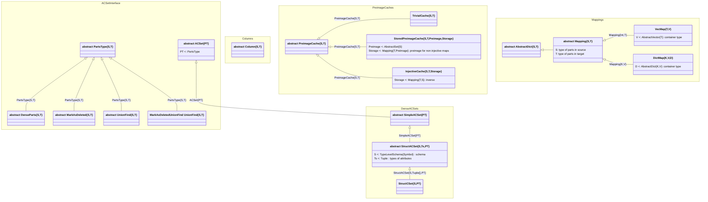

# notes on code design

## types

There are a lot of parameterized types in ACSets.jl that make everything work. It's confusing to figure out what they all do. Let's map them out. We use a directed arrow to denote that the type at the source of the arrow is a subtype of the type at the target of the arrow.

